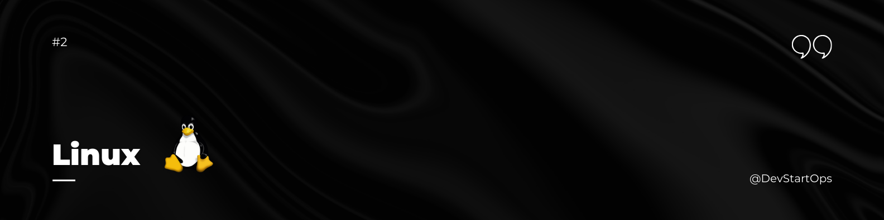

## Introduction

Welcome to the Linux section of the DevStartOps repository! 

Linux is the backbone of modern computing, especially in the world of DevOps. Whether you're managing servers, deploying applications, or writing scripts, a solid understanding of Linux is crucial. This section will guide you through the essential Linux concepts and commands that every DevOps engineer should know.

## Why Linux?

Think of a cloud environment as a vast construction site. The servers, databases, and networks are like the materials and structures. Linux is the blueprint that ensures everything is built correctly and functions smoothly. Without understanding Linux, it's like trying to build a skyscraper without knowing how to read blueprints. In the DevOps world, this understanding is non-negotiable.

## Accessing Linux

Linux can be accessed in various ways, but the most popular methods for DevOps professionals include:

- **VirtualBox:** Running Linux in a virtualized environment on your local machine.
- **AWS EC2 Instance:** Using cloud-based Linux instances for scalable and on-demand computing.

These methods provide a flexible and powerful environment to practice and deploy Linux-based solutions.
4
## Essential Linux Concepts

To get started, here are some of the key Linux concepts and commands that are foundational for DevOps:

### 1. Filesystem Hierarchy
Understanding the Linux filesystem hierarchy is crucial. Familiarize yourself with the structure and common directories like `/etc/`, `/var/`, `/usr/`, `/home/`, and `/tmp/`.

### 2. Basic Commands
- **Navigation:** `cd`, `ls`, `pwd`
- **File Operations:** `cp`, `mv`, `rm`, `touch`, `mkdir`
- **Permissions:** `chmod`, `chown`
- **Viewing Files:** `cat`, `less`, `head`, `tail`

### 3. User and Group Management
Managing users and groups is vital for maintaining security and access control.
- **User Management:** `adduser`, `deluser`, `passwd`
- **Group Management:** `addgroup`, `delgroup`, `usermod`

### 4. Process Management
Monitor and control processes to ensure the system is running efficiently.
- **Viewing Processes:** `ps`, `top`, `htop`
- **Killing Processes:** `kill`, `killall`, `pkill`

### 5. Networking
Understanding networking commands is key for managing servers and applications.
- **IP Configuration:** `ifconfig`, `ip`
- **Network Connections:** `netstat`, `ss`
- **Troubleshooting:** `ping`, `traceroute`, `nslookup`

### 6. Shell Scripting
Automate tasks and manage your systems more effectively using shell scripts.
- **Basics:** `bash`, `sh`
- **Control Structures:** `if`, `else`, `for`, `while`
- **Script Execution:** `./script.sh`, `bash script.sh`

### 7. Systemctl (Service Management)
The `systemctl` command is used to control the systemd system and service manager. It’s vital for starting, stopping, and managing services.
- **Starting a Service:** `systemctl start service_name`
- **Stopping a Service:** `systemctl stop service_name`
- **Checking Service Status:** `systemctl status service_name`
- **Enabling/Disabling Services at Boot:** `systemctl enable service_name`, `systemctl disable service_name`

### 8. SSH (Secure Shell)
SSH is essential for remote server management, enabling secure encrypted connections over potentially insecure networks.
- **Connecting to a Remote Server:** `ssh username@hostname`
- **Transferring Files:** `scp file.txt username@hostname:/path/to/destination`
- **SSH Key Management:** `ssh-keygen`, `ssh-copy-id`

## Practice Makes Perfect

The best way to master Linux is through practice. Set up a Linux virtual machine, play around with the commands, and try writing your own scripts. Break things, fix them, and learn along the way. The more you practice, the more comfortable you’ll become with Linux.

### **Happy Linux-ing!**
