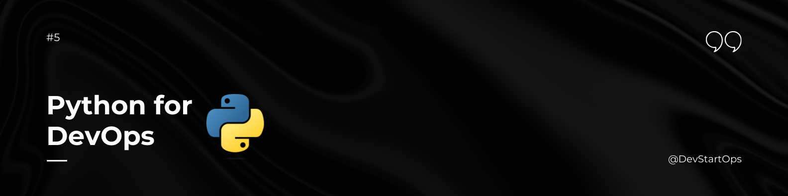

## Introduction

Welcome to the Python section of the DevStartOps repository!

Python is a versatile programming language widely used in DevOps for scripting, automation, and developing tools. Its simplicity and readability make it an excellent choice for both beginners and experienced developers. Whether you're writing scripts to automate tasks or developing applications, a solid understanding of Python will enhance your DevOps skills.

## Why Python?

Imagine you're responsible for managing a fleet of servers. With Python, you can write scripts to automatically update server configurations, monitor system performance, and deploy applications—all without manual intervention. Python's ease of use and flexibility make these tasks more manageable, allowing you to focus on more strategic aspects of your work.

## Installing Python

Here’s a quick guide to installing Python on your system:

### Windows

1. **Download Python:** Visit the [Python website](https://www.python.org/downloads/) and download the installer for Windows.
2. **Run the Installer:** Double-click the installer and check the box that says "Add Python to PATH". Click "Install Now".
3. **Verify Installation:** Open Command Prompt and type:

    ```bash
    python --version
    ```

    This should display the installed Python version.

### macOS

1. **Install Python via Homebrew:** Open Terminal and run:

    ```bash
    brew install python
    ```

2. **Verify Installation:** Type the following command in Terminal:

    ```bash
    python3 --version
    ```

    This should display the installed Python version.

### Linux

1. **Install Python using the package manager:** Open Terminal and run:

    ```bash
    sudo apt-get update
    sudo apt-get install python3
    ```

2. **Verify Installation:** Type the following command:

    ```bash
    python3 --version
    ```

    This should display the installed Python version.

## Learning Python

If you're not confident in your Python skills, I highly recommend checking out the [free Python Masterclass by TrainWithShubham](https://www.youtube.com/live/9ErAlY2Ifw0?si=dECtgI81CrlUItqB). It's a great resource to get up to speed with Python and enhance your programming abilities.

## Essential Python Concepts

Here are some key Python concepts and tools that are useful for DevOps:

### 1. Python Basics
- **Syntax:** Understand Python's simple and readable syntax.
- **Variables and Data Types:** Learn about different data types like strings, integers, lists, and dictionaries.
- **Control Structures:** Use `if`, `for`, and `while` loops to control the flow of your program.

### 2. Scripting and Automation
- **Writing Scripts:** Automate repetitive tasks and manage systems using Python scripts.
- **Libraries:** Utilize libraries such as `os`, `subprocess`, and `sys` to interact with the operating system and perform various tasks.

### 3. Working with Files
- **File I/O:** Read from and write to files using Python's built-in functions.
- **CSV and JSON:** Parse and manipulate data in different formats using libraries like `csv` and `json`.

### 4. Web Scraping
- **Libraries:** Use libraries like `BeautifulSoup` and `requests` to scrape and analyze data from websites.

### 5. API Interaction
- **Requests Library:** Interact with web APIs using the `requests` library to fetch and send data.

### 6. Error Handling
- **Exceptions:** Handle errors gracefully using `try`, `except`, and `finally` blocks.

## Practice Makes Perfect

To master Python, practice writing scripts and solving problems. Try automating tasks, working on projects, and experimenting with different libraries. The more you use Python, the more proficient you'll become.

Python is a versatile and essential tool for DevOps professionals. By understanding its core concepts and applying them to your workflows, you'll be well-equipped to tackle a wide range of tasks and improve your efficiency.

##### **Happy Python-ing!**
