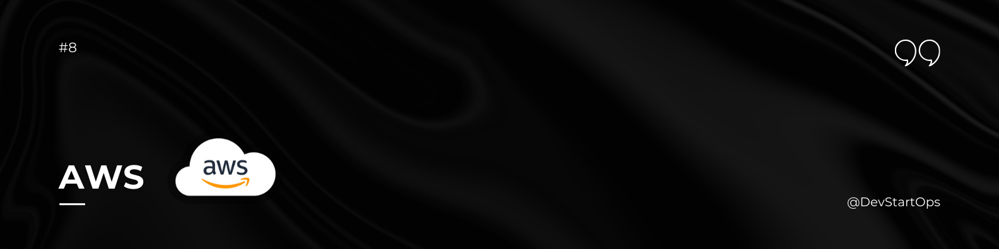

## Introduction

Welcome to the AWS section of the DevStartOps repository!

Amazon Web Services (AWS) is a comprehensive cloud computing platform offering a wide range of services, from compute power to storage solutions, and everything in between. AWS is a cornerstone of modern cloud infrastructure and is integral to many DevOps practices.

## Why AWS?

Consider a startup that needs to deploy a new application quickly and scale it as demand grows. By leveraging AWS, the startup can deploy its application on scalable cloud infrastructure, use managed services to handle databases and monitoring, and easily adjust resources based on traffic, all without the need for physical servers.

## Getting Started with AWS

### Creating an AWS Account

1. **Visit the AWS Website:**
   - Go to [AWS Signup Page](https://aws.amazon.com/).

2. **Start Your Free Tier:**
   - Click on "Create a Free Account" to start the sign-up process.

3. **Enter Account Information:**
   - Provide your email address, password, and AWS account name.

4. **Add Contact Information:**
   - Enter your contact details, including your name, company (optional), and phone number.

5. **Select a Support Plan:**
   - Choose the support plan that best fits your needs (Basic support is free).

6. **Verify Your Identity:**
   - AWS will require you to verify your identity using a phone number. You will receive a call or SMS with a verification code.

7. **Add Payment Information:**
   - Enter your payment details. AWS uses this information for billing purposes, though you won’t be charged if you stay within the Free Tier limits.

8. **Review and Confirm:**
   - Review your account information and confirm that all details are correct.

9. **Sign In to Your AWS Console:**
   - Once your account is created, sign in to the AWS Management Console at [AWS Management Console](https://aws.amazon.com/console/).

## AWS CLI Installation

### For Windows

1. **Download AWS CLI Installer:**

    Visit the [AWS CLI MSI Installer for Windows](https://awscli.amazonaws.com/AWSCLIV2.msi) and download the installer.

2. **Run Installer:**

    Double-click the downloaded MSI file and follow the on-screen instructions.

3. **Verify Installation:**

    Open Command Prompt and run:

    ```cmd
    aws --version
    ```

## Key AWS Services

- **EC2 (Elastic Compute Cloud):** Scalable virtual servers for running applications.
- **S3 (Simple Storage Service):** Object storage for storing and retrieving any amount of data.
- **RDS (Relational Database Service):** Managed relational databases for scalable applications.
- **Lambda:** Serverless compute service for running code without provisioning servers.
- **CloudFormation:** Infrastructure as Code (IaC) for automating the setup of AWS resources.

AWS provides a robust platform for building, deploying, and managing cloud applications. By mastering AWS, you'll gain the ability to leverage powerful cloud services to enhance your DevOps practices and scale your applications efficiently.

##### **Happy Cloud Computing!**