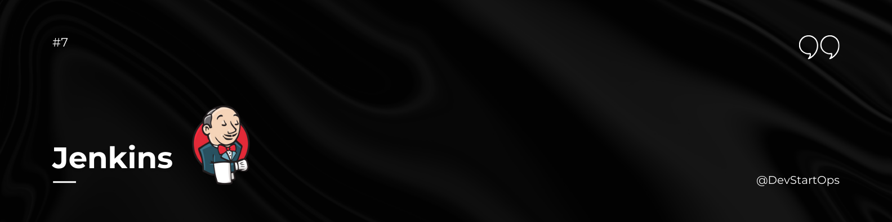

## Introduction

Welcome to the CI/CD section of the DevStartOps repository!

Continuous Integration (CI) and Continuous Deployment (CD) are practices that help development teams deliver code changes more frequently and reliably. Jenkins is a popular open-source tool that automates these practices by building, testing, and deploying applications.

## Why Jenkins?

Imagine a factory assembly line where each product needs to go through several stages of quality checks before it reaches the customer. Jenkins acts as this assembly line for your code, ensuring that every change goes through a series of automated tests and deployments before it’s released. This automation helps catch issues early, speeds up development cycles, and maintains high-quality software.

## Configuring Jenkins

### 1. Creating a New Job

1. **Access Jenkins Dashboard:**
   - Open `http://localhost:8080` in your web browser.

2. **Create a New Job:**
   - Click on **"New Item"** from the Jenkins dashboard.
   - Enter a name for your job and select **"Freestyle project"** or **"Pipeline"** based on your needs.
   - Click **"OK"** to create the job.

3. **Configure Build Triggers:**
   - In the job configuration page, scroll down to the **"Build Triggers"** section.
   - Choose the appropriate trigger for your job (e.g., **"GitHub hook trigger for GITScm polling"** for GitHub).

4. **Add Build Steps:**
   - In the **"Build"** section, add build steps such as **"Execute shell"** or **"Invoke Gradle script"** based on your build requirements.

5. **Save Configuration:**
   - Click **"Save"** to apply the configuration.

### 2. Setting Up Jenkins Pipeline

1. **Create a Pipeline Job:**
   - Follow the same steps as creating a new job but select **"Pipeline"** instead of **"Freestyle project"**.

2. **Define Pipeline Script:**
   - In the **"Pipeline"** section of the job configuration, choose **"Pipeline script"** and write your pipeline code in the provided text area.

   Example Pipeline Script:

   ```groovy
   pipeline {
       agent any
       stages {
           stage('Build') {
               steps {
                   echo 'Building...'
               }
           }
           stage('Test') {
               steps {
                   echo 'Testing...'
               }
           }
           stage('Deploy') {
               steps {
                   echo 'Deploying...'
               }
           }
       }
   }

3. **Save Pipeline Configuration:**
   - Click **"Save"** to apply the configuration.

## Practice Makes Perfect
To master Jenkins, practice setting up different types of jobs and pipelines. Experiment with plugins, triggers, and configurations to become more proficient in automating your CI/CD processes.

### **Happy Jenkins-ing!**