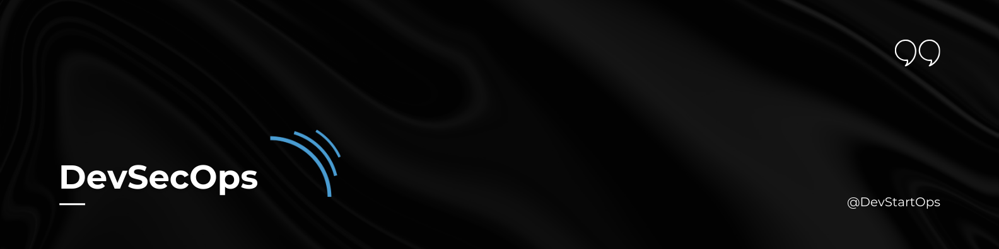

# SonarQube 

## Introduction

Welcome to the SonarQube section of the DevStartOps repository!

SonarQube is a powerful DevSecOps tool that helps you continuously inspect the code quality and security of your applications. It performs static code analysis to detect bugs, vulnerabilities, and code smells, ensuring your codebase remains robust and secure.

## Why SonarQube?

Imagine having a meticulous quality assurance team that reviews every line of code for potential issues and vulnerabilities. SonarQube acts as this virtual team, offering in-depth analysis and actionable insights to improve code quality and security. It helps maintain high standards by integrating seamlessly into your CI/CD pipeline, providing real-time feedback on code changes.

## Key Features

- **Code Quality Analysis:** Detect code smells, bugs, and vulnerabilities.
- **Security Vulnerability Detection:** Identify potential security risks in your codebase.
- **Technical Debt Tracking:** Measure and manage technical debt to keep your codebase maintainable.
- **Integration:** Seamlessly integrates with Jenkins, GitHub, and other CI/CD tools for continuous analysis.

## Essential Concepts

1. **Projects:** SonarQube analyzes code within projects, providing detailed reports and metrics.
2. **Quality Gates:** Define quality standards and ensure code meets these requirements before merging.
3. **Rules and Metrics:** Customize rules and track metrics tailored to your project's needs.

SonarQube is an essential tool for maintaining high code quality and security in your DevSecOps practices. By integrating SonarQube into your development pipeline, you'll ensure that your code is not only functional but also secure and maintainable.

##### **Happy Code Reviewing!**