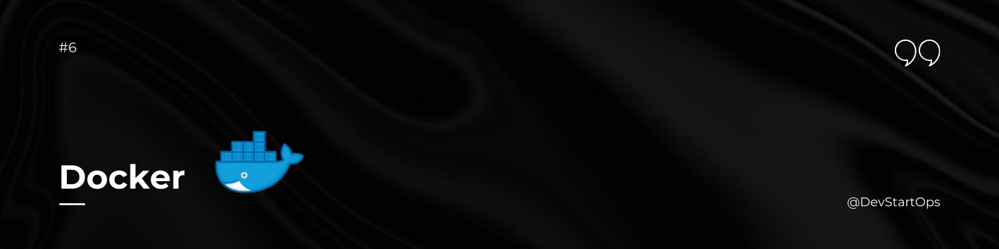

## Introduction

Welcome to the Docker section of the DevStartOps repository!

Docker is a powerful tool that enables you to automate the deployment of applications inside lightweight, portable containers. Containers package your application and its dependencies together, ensuring consistency across various environments. Whether you're developing locally, testing, or deploying to production, Docker provides a seamless and efficient solution.

## Why Docker?

Imagine you have a well-dressed actor performing in a play. The actor can perform anywhere, from a small theater to a grand stage, without worrying about the surrounding environment. Docker works similarly by packaging your application and its dependencies into a container, making sure it runs consistently regardless of where it's deployed.

## Installing Docker

To get started with Docker, you need to install Docker Engine and Docker Compose on your system. Follow the steps below for your operating system:

### Windows

1. **Download Docker Desktop:**
   - Visit the [Docker Desktop for Windows page](https://www.docker.com/products/docker-desktop) and download the installer.

2. **Run the Installer:**
   - Double-click the downloaded file and follow the installation prompts. You might need to enable the WSL 2 feature during installation.

3. **Verify Installation:**
   - Open Command Prompt or PowerShell and type:

     ```bash
     docker --version
     docker-compose --version
     ```

     These commands should display the installed Docker and Docker Compose versions.

## Key Docker Concepts

Here are some essential Docker concepts and commands that are foundational for DevOps:

### 1. Docker Images

- **Definition:** Docker images are read-only templates used to create containers. They contain everything needed to run an application, including the code, runtime, libraries, and dependencies.
- **Creating Images:** Use a `Dockerfile` to define the configuration of your image.

### 2. Docker Containers

- **Definition:** Containers are instances of Docker images. They run your application in a lightweight, isolated environment.
- **Running Containers:** Start a container using the `docker run` command.

    ```bash
    docker run -d -p 80:80 --name my_container my_image
    ```

### 3. Docker Compose

- **Definition:** Docker Compose is a tool for defining and running multi-container Docker applications. You use a `docker-compose.yml` file to configure your application’s services, networks, and volumes.
- **Starting Services:** Use the `docker-compose up` command to start services defined in your `docker-compose.yml` file.

    ```bash
    docker-compose up -d
    ```

### 4. Docker Networking

- **Overview:** Docker provides different networking options for containers to communicate with each other and with the external world.
- **Types of Networks:**
  - **Bridge Network:** Default network driver for containers.
  - **Host Network:** Containers share the host’s network stack.
  - **Overlay Network:** Used for communication between containers on different Docker hosts.

### 5. Docker Volumes

- **Definition:** Volumes are used to persist data generated by and used by Docker containers. They are stored on the host filesystem and can be shared between containers.
- **Creating Volumes:** Use the `docker volume create` command to create a new volume.

    ```bash
    docker volume create my_volume
    ```

### 6. Docker Commands

Here are some useful Docker commands:

- **List Images:** View all Docker images on your system.

    ```bash
    docker images
    ```

- **Remove Image:** Remove a Docker image.

    ```bash
    docker rmi my_image
    ```

- **List Containers:** View all running containers.

    ```bash
    docker ps
    ```

- **Stop Container:** Stop a running container.

    ```bash
    docker stop my_container
    ```

- **Remove Container:** Remove a stopped container.

    ```bash
    docker rm my_container
    ```
## Practice Makes Perfect

Docker is an essential tool for modern DevOps practices. By understanding its core concepts and using it effectively, you’ll be able to automate deployments, ensure consistency, and improve your workflow.

##### **Happy Dockering!**
