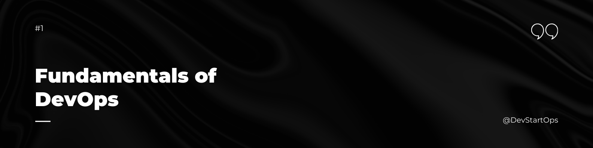

Before diving in, check out this comprehensive DevOps roadmap created by my most favorite mentor, **Shubham Londhe Bhaiyya**:

- [DevOps Roadmap on Miro](https://miro.com/app/board/uXjVKq3-e8I=/)
- [Google Sheets Roadmap and Time Tracking Sheet](https://docs.google.com/spreadsheets/d/1eE-NhZQFr545LkP4QNhTgXcZTtkMFeEPNyVXAflXia0/edit?gid=2073716385#gid=2073716385)

## Introduction
Welcome to the Fundamentals section of the DevStartOps repository! Whether you're just getting started with DevOps or looking to solidify your understanding, this guide will walk you through the core concepts, culture, tools, and the best roadmap to becoming proficient in DevOps.

Imagine a busy kitchen in a high-end restaurant. The chefs (developers) are responsible for creating delicious dishes (applications), while the waitstaff (operations) ensure that these dishes reach the customers smoothly and on time. In a traditional setup, if the chefs and waitstaff don’t communicate effectively, orders might get delayed, mistakes can happen, and ultimately, the customer experience suffers.

DevOps is like bringing the chefs and waitstaff together into one team, ensuring they collaborate seamlessly to deliver the best dining experience. In the world of software development, DevOps is a cultural and technical movement that aims to unify development (Dev) and operations (Ops) to improve collaboration, speed up delivery, and ensure high-quality software releases.

## What is DevOps?
DevOps is a set of practices that combines software development (Dev) and IT operations (Ops). It aims to shorten the software development lifecycle and provide continuous delivery with high software quality. DevOps is not just a set of tools but a cultural shift that encourages collaboration between traditionally siloed teams.

## DevOps Tools
Just like a chef uses various tools to prepare meals, DevOps practitioners use a variety of tools to automate, monitor, and manage applications and infrastructure. Here's a high-level overview of some essential DevOps tools:

- **Linux Fundamentals:** Essential knowledge for DevOps
- **Version Control Systems:** Git, GitHub
- **Containerization:** Docker
- **CI/CD Pipelines:** Jenkins, GitLab CI/CD
- **Cloud Platforms:** AWS, Azure, Google Cloud 
- **Orchestration:** Kubernetes
- **Infrastructure as Code (IaC):** Terraform, CloudFormation
- **Configuration Management:** Ansible, Puppet, Chef
- **Monitoring:** Prometheus, Grafana

 ##### **Happy DevOps-ing!**