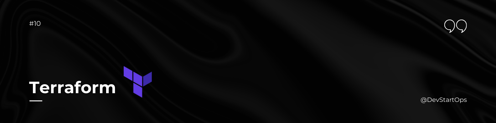

# Terraform

Terraform is an open-source Infrastructure as Code (IaC) tool that allows you to define and provision infrastructure using a high-level configuration language. It supports multiple cloud providers, making it a versatile choice for managing your infrastructure.

## Why Terraform?

Terraform is like a blueprint for your infrastructure. Imagine you're building a house. Instead of manually placing bricks and setting up utilities, you use detailed blueprints to guide the construction process. Terraform provides these blueprints for your cloud infrastructure, ensuring consistency, repeatability, and version control.

## Key Concepts

### Variables

Variables in Terraform allow you to parameterize your configurations and make them reusable. They are defined in `variables.tf` and can be set via `.tfvars` files, environment variables, or directly in the configuration.

**Example:**

```hcl
# variables.tf
variable "instance_type" {
  description = "Type of EC2 instance"
  type        = string
  default     = "t2.micro"
}

# main.tf
resource "aws_instance" "example" {
  ami           = "ami-0c55b159cbfafe1f0"
  instance_type = var.instance_type
}
```
### Outputs

Outputs are used to extract and display information about your resources after they have been created. Outputs are defined in `outputs.tf` and can be used to share information between modules or display important values.

```hcl
# outputs.tf
output "instance_id" {
  description = "The ID of the EC2 instance"
  value       = aws_instance.example.id
}
```
### Modules
Modules are containers for multiple resources that are used together. They allow you to organize and reuse your Terraform configurations. Modules can be local or sourced from the Terraform Registry.

```hcl
# main.tf
module "vpc" {
  source = "./modules/vpc"
  cidr   = "10.0.0.0/16"
}

module "instance" {
  source        = "./modules/instance"
  instance_type = "t2.micro"
}
```

### States
Terraform uses state files to keep track of the resources it manages. The state file maps your configuration to real-world resources, enabling Terraform to determine what changes need to be applied. State files are stored locally by default but can be stored remotely for team environments.

```hcl
# Initialize a working directory containing Terraform configuration files
terraform init

# Show the current state of your resources
terraform state list

# Show detailed information about a resource in the state
terraform state show <resource_name>
```

### Providers
Providers are plugins that Terraform uses to interact with cloud providers, SaaS providers, and other APIs. Providers are specified in provider.tf and manage the lifecycle of resources.

```hcl
# provider.tf
provider "aws" {
  region = "us-west-2"
}
```

### Resources
Resources represent a single piece of infrastructure. Each resource is defined in your Terraform configuration files and corresponds to a real-world entity, such as an EC2 instance, a database, or a VPC.

```hcl
# main.tf
resource "aws_instance" "example" {
  ami           = "ami-0c55b159cbfafe1f0"
  instance_type = "t2.micro"
}
```

### Remote Backend
Remote backends store Terraform state files remotely, providing benefits like team collaboration and state locking. Remote backends support different storage solutions such as AWS S3, Azure Blob Storage, and HashiCorp Consul.

```hcl
# backend.tf
terraform {
  backend "s3" {
    bucket         = "my-terraform-state"
    key            = "terraform/state"
    region         = "us-west-2"
    encrypt        = true
    dynamodb_table = "terraform-lock"
  }
}
```
In this example, the backend **"s3"** configuration specifies that Terraform should store state files in an S3 bucket and use DynamoDB for state locking to prevent concurrent operations.

## How to Use Terraform

- **Write Configuration Files:** Define your infrastructure in .tf files.
- **Initialize Terraform:** Run terraform init to initialize the configuration directory.
- **Plan Changes:** Use terraform plan to preview changes before applying.
- **Apply Changes:** Execute terraform apply to create or update infrastructure.
- **Destroy Infrastructure:** Run terraform destroy to remove the infrastructure.

## Example of Workflow

```hcl 
# Initialize Terraform configuration
terraform init

# Review changes to be applied
terraform plan

# Apply changes to the infrastructure
terraform apply

# Destroy all resources managed by Terraform
terraform destroy
```

Terraform is an essential tool for automating and managing your infrastructure. By integrating Terraform into your workflow, you'll ensure that your infrastructure is consistent, scalable, and easy to manage across multiple environments.

### **Happy Automating!**

