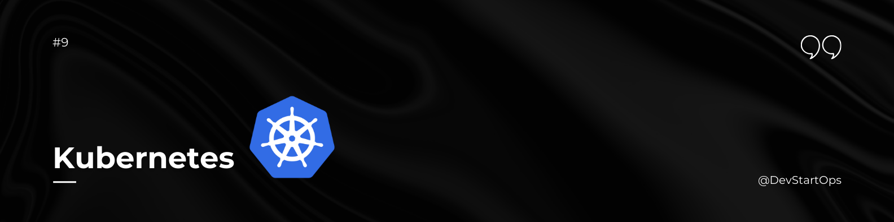

## Introduction

Welcome to the Kubernetes section of the DevStartOps repository!

Kubernetes (K8s) is an open-source platform for automating the deployment, scaling, and management of containerized applications. It’s a key component of modern cloud-native architectures and DevOps practices.

## Kubernetes Architecture

Kubernetes follows a master-slave architecture with several key components:

### 1. Master Node

- **API Server:** The API server is the gateway for all interactions with the Kubernetes cluster. It handles API requests and updates the cluster state.
- **Controller Manager:** Ensures that the cluster's state matches the desired state by managing controllers that handle replication, endpoints, and more.
- **Scheduler:** Assigns newly created pods to nodes based on resource availability and other constraints.
- **etcd:** A distributed key-value store that stores all cluster data and configuration.

### 2. Worker Nodes

- **Kubelet:** An agent that runs on each worker node, ensuring containers are running in pods as specified by the API server.
- **Kube-Proxy:** Maintains network rules on nodes and facilitates communication between pods and services.
- **Container Runtime:** Software responsible for running containers, such as Docker or containerd.

### 3. Key Concepts

- **Pod:** The smallest deployable unit in Kubernetes, a pod encapsulates one or more containers.
- **Service:** An abstraction that defines a logical set of pods and a policy to access them.
- **Deployment:** Manages the deployment and scaling of pods, ensuring the desired number of replicas are running.
- **Namespace:** A way to divide cluster resources between multiple users or applications.

### 4. Ingress Controller

- **Definition:** An Ingress Controller is a Kubernetes resource that manages external access to services, typically HTTP. It routes traffic based on defined rules.
- **Common Controllers:** NGINX, Traefik.

### 5. Ingress

- **Definition:** Ingress is a set of rules for the inbound traffic to reach services within the cluster. It provides URL-based routing, SSL/TLS termination, and more.

### 6. RBAC (Role-Based Access Control)

- **Definition:** RBAC provides fine-grained access control within Kubernetes, allowing you to define who can perform what actions on which resources.
- **Key Resources:** Roles, RoleBindings, ClusterRoles, ClusterRoleBindings.

### 7. HPA (Horizontal Pod Autoscaler)

- **Definition:** HPA automatically scales the number of Pods in a deployment or replica set based on CPU utilization or other select metrics.

### 8. Service Account

- **Definition:** Service Accounts provide an identity for processes running in Pods to interact with the Kubernetes API server. They are used to manage permissions for applications.

Understanding Kubernetes architecture is crucial for managing containerized applications efficiently. With this foundational knowledge, you’re ready to explore and implement Kubernetes in your DevOps practices.

##### **Happy Container Orchestration!**
