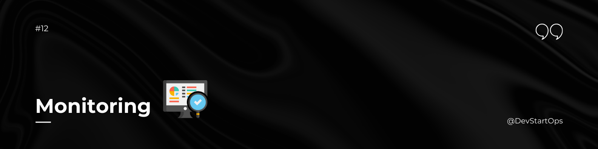

## Introduction

The Monitoring folder provides essential information about key monitoring tools: Grafana, Prometheus, cAdvisor, and Loki. These tools are crucial for visualizing and managing metrics, logs, and system performance.

## Grafana

Grafana is an open-source platform for monitoring and observability. It allows you to visualize and analyze data from various sources in real-time through customizable dashboards.

### Key Features

- **Custom Dashboards:** Create and share dashboards tailored to your needs.
- **Data Source Integration:** Connect to a variety of data sources like Prometheus, Elasticsearch, and more.
- **Alerting:** Set up alerts to notify you of important changes in your data.

In a large-scale application deployment, Grafana can be used to create dashboards that visualize key performance metrics, such as CPU and memory usage, from multiple servers. This helps in identifying and resolving performance bottlenecks.

## Prometheus

Prometheus is an open-source monitoring and alerting toolkit designed for reliability and scalability. It collects metrics from configured endpoints at specified intervals and provides a powerful query language for analyzing the collected data.

### Key Features

- **Time-Series Data:** Store and query metrics data with high dimensionality.
- **Powerful Query Language:** Use PromQL to query and aggregate data.
- **Alerting:** Integrate with Alertmanager to handle alerts based on your metrics.

Prometheus can be used to monitor application performance metrics, such as response times and error rates. By querying these metrics, you can set up alerts that notify you when certain thresholds are breached, ensuring proactive management of system performance.

## cAdvisor

cAdvisor (Container Advisor) provides container users with an understanding of the resource usage and performance characteristics of their running containers. It collects, aggregates, processes, and exports information about running containers.

### Key Features

- **Resource Usage:** Track CPU, memory, disk, and network usage of containers.
- **Performance Metrics:** Get insights into container performance over time.
- **Real-Time Monitoring:** Monitor container metrics in real-time through a web interface.

For a containerized application, cAdvisor helps in tracking the performance and resource usage of each container. This information is valuable for optimizing resource allocation and troubleshooting performance issues.

## Loki

Loki is a log aggregation system that is designed to work seamlessly with Prometheus. It allows you to aggregate and search logs from various sources, making it easier to correlate logs with metrics.

### Key Features

- **Log Aggregation:** Collect and aggregate logs from multiple sources.
- **Integration with Grafana:** Visualize logs alongside metrics in Grafana dashboards.
- **Scalable:** Designed to handle large volumes of log data efficiently.

When debugging a production issue, Loki can be used to aggregate logs from different services and applications. By correlating these logs with Prometheus metrics, you can get a comprehensive view of the system’s state and identify the root cause of issues more effectively.

##
Grafana, Prometheus, cAdvisor, and Loki are powerful tools that enhance your ability to monitor and manage your infrastructure. By integrating these tools, you gain comprehensive visibility into system performance, resource usage, and logs, enabling more effective and proactive management of your applications.

**Happy Monitoring!**