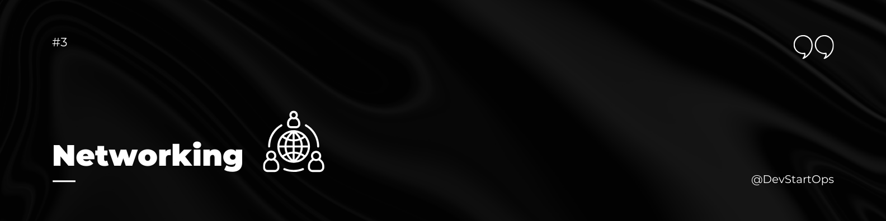

## Introduction

Welcome to the Networking section of the DevStartOps repository!

Networking is a crucial component of DevOps. It connects all the pieces together, from your local environment to the cloud, ensuring that data flows seamlessly between systems, applications, and users. Understanding networking is essential for managing servers, deploying applications, and troubleshooting issues in a distributed environment.

## Why Networking?

Consider a web application that is slow to load for users in certain regions. As a DevOps engineer, you would need to diagnose whether the issue is related to the server, the database, or the network. Understanding networking allows you to trace the data's journey, identify where the slowdown is occurring, and take steps to resolve the issue. Without this knowledge, troubleshooting would be like searching for a needle in a haystack.

## Essential Networking Concepts

Here are some key networking concepts and commands that are foundational for DevOps:

### 1. IP Addressing
Every device on a network is identified by an IP address. Understanding IP addressing, both IPv4 and IPv6, is fundamental.
- **Command:** `ifconfig`, `ip`

### 2. DNS (Domain Name System)
DNS translates human-readable domain names (like www.example.com) into IP addresses that computers use to communicate.
- **Command:** `nslookup`, `dig`

### 3. Subnetting
Subnetting divides a network into smaller, more efficient subnetworks. It's important for managing large networks and conserving IP addresses.

### 4. Routing and Switching
Routing directs data packets between different networks, while switching manages data flow within a network.
- **Command:** `route`, `ip route`

### 5. Firewall Management
Firewalls protect networks by controlling incoming and outgoing traffic based on predetermined security rules.
- **Command:** `iptables`, `ufw`

### 6. Load Balancing
Load balancers distribute incoming network traffic across multiple servers to ensure no single server becomes overwhelmed.
- **Tools:** Nginx, HAProxy

### 7. VPN (Virtual Private Network)
VPNs create a secure connection over a public network, allowing secure remote access to private networks.
- **Tools:** OpenVPN, WireGuard

### 8. Network Monitoring and Troubleshooting
Monitoring tools help you keep an eye on network performance, while troubleshooting commands help you diagnose and resolve issues.
- **Command:** `ping`, `traceroute`
- **Tools:** Wireshark, tcpdump, Netcat

### 9. Network Security
Securing a network involves using a combination of firewalls, encryption, and secure protocols to protect data.
- **Tools:** SSL/TLS, SSH, VPN

## Practice Makes Perfect

To master networking, you need hands-on experience. Set up your own home lab, configure a virtual network, and experiment with different tools and commands. Try to simulate real-world scenarios, such as setting up a VPN or diagnosing a network issue, to build your confidence and skills.

Networking is the glue that holds the entire infrastructure together in DevOps. By mastering the concepts and tools outlined here, you'll be well-prepared to tackle more complex networking challenges as you advance in your DevOps journey.

##### **Happy Networking!**
