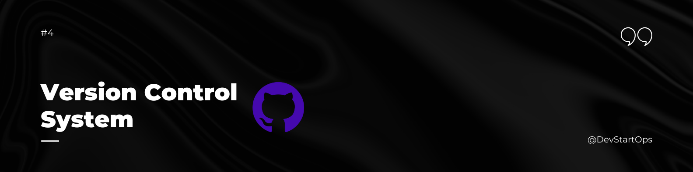

## Introduction

Welcome to the Version Control Systems section of the DevStartOps repository!

Version control systems (VCS) are essential in modern software development and DevOps practices. They allow multiple developers to collaborate on code, track changes, and manage different versions of a project. Git is the most widely used version control system, and understanding its core concepts and commands is crucial for any DevOps engineer.

## Why Version Control Systems?

Consider a scenario where your team is working on a critical feature for a web application. Suddenly, a bug is discovered in production. With version control, you can quickly switch to a previous version of the code, fix the bug, and deploy the patch—all without disrupting the ongoing development work. This ability to manage code versions efficiently is what makes VCS indispensable in DevOps.


#### **Steps to Install Git Bash:**

1. **Download Git:** Visit the official [Git website](https://git-scm.com/downloads) and download the Git installer for your operating system.
2. **Run the Installer:** Double-click the downloaded file and follow the installation prompts. You can keep the default settings for most options.
3. **Verify Installation:** After installation, open Git Bash (you can find it in your Start Menu or Applications) and type the following command to verify the installation:

    ```bash
    git --version
    ```

    This should return the installed Git version.

### 2. Creating a GitHub Account

GitHub is a platform for hosting and managing Git repositories. To start using GitHub, you need to create an account.

#### **Steps to Create a GitHub Account:**

1. **Sign Up:** Go to [GitHub](https://github.com/) and click on "Sign up" in the top right corner.
2. **Enter Details:** Provide your email address, create a password, and choose a username. Follow the prompts to complete the registration process.
3. **Verify Email:** GitHub will send you a verification email. Click the link in the email to verify your account.
4. **Set Up Profile:** Once your account is verified, you can set up your profile by adding a bio, profile picture, and other details.

## Essential Git Concepts and Commands

Here are some of the key Git commands that every DevOps engineer should know:

### 1. Git Basics
- **Initialize a Repository:** `git init`
- **Clone a Repository:** `git clone <repository_url>`
- **Check Status:** `git status`
- **Stage Changes:** `git add <file>`
- **Commit Changes:** `git commit -m "commit message"`
- **Push to Remote:** `git push origin <branch_name>`
- **Pull from Remote:** `git pull origin <branch_name>`

### 2. Branching and Merging
- **Create a Branch:** `git branch <branch_name>`
- **Switch Branches:** `git checkout <branch_name>`
- **Merge Branches:** `git merge <branch_name>`
- **Delete a Branch:** `git branch -d <branch_name>`

### 3. Viewing History
- **View Commit History:** `git log`
- **View Changes:** `git diff`
- **Show a Commit:** `git show <commit_hash>`

### 4. Undoing Changes
- **Git Stash:** Temporarily save changes that are not ready to be committed.
  - **Stash Changes:** `git stash`
  - **Apply Stash:** `git stash apply`
  - **List Stashes:** `git stash list`
  - **Drop Stash:** `git stash drop`
- **Git Reset:** Undo changes in the working directory and staging area.
  - **Soft Reset:** `git reset --soft <commit_hash>` (keeps changes in the working directory)
  - **Mixed Reset:** `git reset --mixed <commit_hash>` (default, unstages changes)
  - **Hard Reset:** `git reset --hard <commit_hash>` (discards changes)
- **Git Revert:** Create a new commit that undoes the changes from a previous commit.
  - **Revert a Commit:** `git revert <commit_hash>`

### 5. Remote Repositories
- **Add a Remote:** `git remote add <name> <url>`
- **Remove a Remote:** `git remote remove <name>`
- **List Remotes:** `git remote -v`

### 6. Tagging
- **Create a Tag:** `git tag <tag_name>`
- **List Tags:** `git tag`
- **Push Tags to Remote:** `git push origin <tag_name>`

## Practice Makes Perfect

The best way to get comfortable with Git is through practice. Set up a personal project, use Git to track changes, and experiment with branching, merging, and rebasing. Try resolving conflicts and explore the power of commands like `git stash` and `git reset` in different scenarios.

##### **Happy Versioning!**